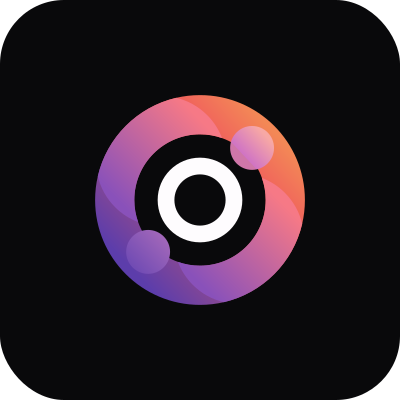

    

<h1 align="center">In.Orbit</h1>

The Weekly Goal Tracker is a project that allows users to set and track their goals, monitoring progress on a weekly basis. This project was developed during the **Next Level Week (NLW)** event by **Rocketseat**.

**Objectives**: The main goals of this application were to train the use of the following tools/technologies:

- Developing a back-end with `Node.js`, using the Fastify framework
- Building a REST API and integrating `DrizzleORM` with `PostgreSQL`
- Validating data with `Zod`
- Containerizing the application using `Docker`
- Creating a responsive front-end with `ReactJS` and `TailwindCSS`
- Handling asynchronous data with `TanStack Query`
- And more...

* If you like the project, please give it a star⭐ and share it to help me out 👍, and follow me to see more of my projects.

## 🚀 Technologies

This project was developed with the following technologies:

✔ Node.js   
✔ TypeScript   
✔ Fastify   
✔ DrizzleORM   
✔ PostgreSQL   
✔ Docker   
✔ Zod   
✔ ReactJS   
✔ Vite  
✔ TailwindCSS   
✔ TanStack Query

## 🎨 Layout

You can view the project layout through [this link](<https://www.figma.com/design/0HMLWitBkwnoIVzxhP3yOR/NLW-Pocket-JS-%E2%80%A2-in.orbit-(Community)?node-id=82-2&node-type=canvas>). You will need a [Figma](https://www.figma.com/) account to access it.

## 📋 Clipboard (Prerequisites)

Before downloading the project, you will need to have the following tools installed on your machine:

- [Git](https://git-scm.com)
- [NodeJS](https://nodejs.org/en/)
- [NPM](https://www.npmjs.com/)
- [DOCKER](https://www.docker.com/)

